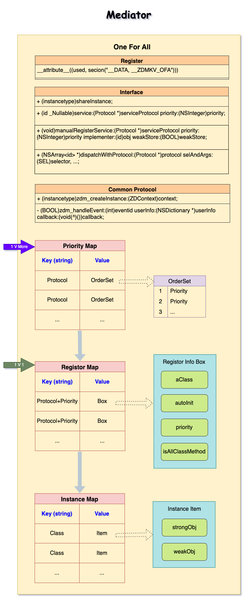
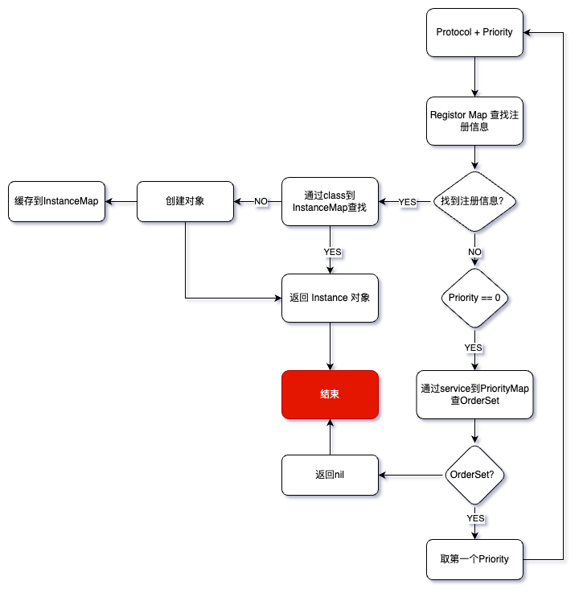

# ZDMediator

[](https://cocoapods.org/pods/ZDMediator)
[](https://cocoapods.org/pods/ZDMediator)
[](https://cocoapods.org/pods/ZDMediator)

## Example

To run the example project, clone the repo, and run `pod install` from the Example directory first.

The run `Test.m`.

## Requirements

## Installation

ZDMediator is available through [CocoaPods](https://cocoapods.org). To install
it, simply add the following line to your Podfile:

```ruby
pod 'ZDMediator'
```

## Feature

- 自动或手动注册
- 自主控制生命周期
- 实例方法、类方法
- 事件分发
- 一个对象对应多个协议
- 一个协议多个对象对应
- 安全

## Usage

> 更多用例请查看`Test.m`文件 

- 注册

```objectivec
/// 自动注册
ZDMediatorOFARegister(CatProtocol, ZDCat, 10)

//⚠️ 如果是一对多（一个协议多个对象遵守），priority一定不能重复，
//⚠️ 如下面的cat和dog不能使用同一个priority
ZDMediatorOFARegister(AnimalProtocol, ZDCat, 0)
ZDMediatorOFARegister(AnimalProtocol, ZDDog, 1)

 ------

/// 手动注册
ZDCat *cat = [ZDCat new];
[ZDMOneForAll manualRegisterService:@protocol(CatProtocol) priority:1 implementer:cat weakStore:YES];
```

- 读取

```objectivec
// 通过priority拿到的是dog对象，如果不传则默认取数组中第一个
NSString *animalName = [GetServiceWithPriority(AnimalProtocol, 1) animalName];
XCTAssertTrue([animalName isEqualToString:@"小狗"]);
```

## 结构



## 粗略流程


## Q&A

1. `priority`是做什么用的？

    查表`key`的一部分，是必须要设置的

2. 如何保证安全性的？

    执行方法调用的其实是`proxy`对象，内部通过消息转发把异常处理掉

## Swift Macho

> [一个实用的Swift属性](https://mp.weixin.qq.com/s/fEFL3GxYaRJ_f5n4UuwuiA)

```swift
@_used 
@_section("__DATA,__mod_init_func")
let initialize: @convention(c) () -> Void = {
    debugPrint("Swift Macho")
}
```

## Author

Zero.D.Saber, fuxianchao@gmail.com

## License

ZDMediator is available under the MIT license. See the LICENSE file for more info.
