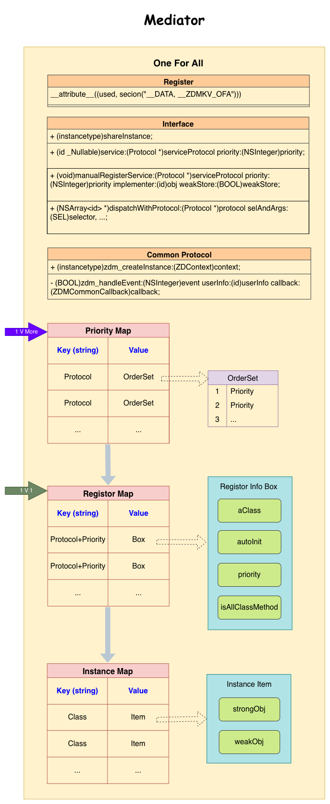
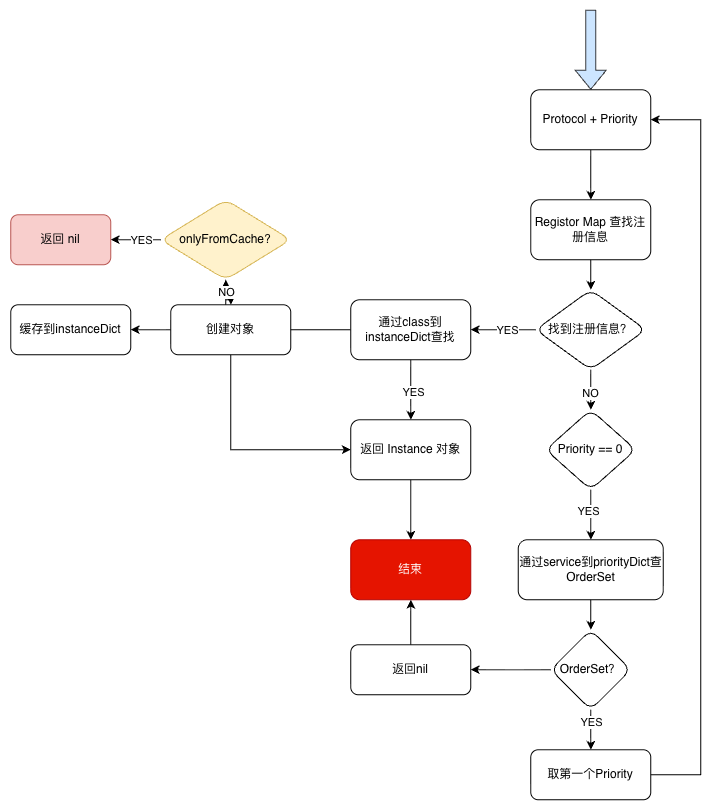

# ZDMediator

[](https://cocoapods.org/pods/ZDMediator)
[](https://cocoapods.org/pods/ZDMediator)
[](https://cocoapods.org/pods/ZDMediator)

## Example

To run the example project, clone the repo, and run `pod install` from the Example directory first.

参考用例：

- Objective-C: `Example/Tests/Tests`
- Swift: `Example/Tests/Tests/Test.swift`

## Requirements

## Installation

ZDMediator is available through [CocoaPods](https://cocoapods.org). To install
it, simply add the following line to your Podfile:

```ruby
pod 'ZDMediator'
```

## Feature

- Mach-O 自动注册、运行时手动注册
- 支持 1 对 1、1 对多协议映射
- 支持实例方法和类方法服务
- 按需初始化与生命周期回调
- 事件注册、定向分发、全量广播
- 弱引用缓存与安全消息转发

## Usage

> 更多完整示例可查看 `Example/Tests/Tests` 和 `Example/Tests/Animals`。

### 1. 定义服务协议

推荐让业务协议继承 `ZDMCommonProtocol`，这样服务可以接入优先级、自定义创建、初始化回调和通用事件。

```objectivec
#import <ZDMediator/ZDMCommonProtocol.h>

@protocol AnimalProtocol <ZDMCommonProtocol>

- (NSString *)animalName;
- (void)eatFood;

@end
```

### 2. 自动注册

自动注册通过 Mach-O section 完成，通常直接写在实现文件顶部。

```objectivec
#import <ZDMediator/ZDMediator.h>

ZDMediator1V1Register(CatProtocol, ZDCat)
ZDMediatorOFARegister(AnimalProtocol, ZDCat, 0)
ZDMediatorOFARegister(AnimalProtocol, ZDDog, 10)

@implementation ZDDog

+ (NSInteger)zdm_priority {
    // 如果实现了该方法，会覆盖宏里传入的 priority
    return 12345;
}

@end
```

说明：

- `ZDMediator1V1Register(protocol, cls)` 等价于使用 `ZDMDefaultPriority` 的 1 对 1 注册。
- `ZDMediatorOFARegister(protocol, cls, priority)` 适合一个协议对应多个实现。
- 同一个协议下多个实现的 `priority` 不能重复。
- 如果类实现了 `+zdm_priority`，最终优先级以该方法返回值为准。

### 3. 手动注册

#### 注册实例

```objectivec
ZDCat *cat = [ZDCat new];
[ZDMOneForAll manualRegisterService:@protocol(CatProtocol) implementer:cat];
```

#### 注册指定优先级

```objectivec
ZDTiger *tiger = [ZDTiger new];
[ZDMOneForAll manualRegisterService:@protocol(AnimalProtocol)
                           priority:100
                        implementer:tiger
                          weakStore:NO];
```

#### 弱引用存储

适合不希望 mediator 强持有服务实例的场景。对象释放后，会自动从缓存中移除。

```objectivec
ZDTiger *tiger = [ZDTiger new];
[ZDMOneForAll manualRegisterService:@protocol(AnimalProtocol)
                           priority:100
                        implementer:tiger
                          weakStore:YES];
```

#### 注册类对象

如果 `implementer` 直接传入 `Class`，会按“类方法服务”处理。

```objectivec
[ZDMOneForAll manualRegisterService:@protocol(ZDClassProtocol)
                        implementer:ZDDog.class];

id<ZDClassProtocol> service = ZDMGetService(ZDClassProtocol);
NSArray *values = [service foo:@[@1, @2] bar:@[@3, @4, @5]];
```

### 4. 获取服务

#### 按协议读取

```objectivec
id<CatProtocol> cat = ZDMGetService(CatProtocol);
NSString *name = [cat name];
```

#### 按优先级读取

```objectivec
id<AnimalProtocol> dog = ZDMGetServiceWithPriority(AnimalProtocol, ZDDog.zdm_priority);
NSString *animalName = [dog animalName]; // 小狗
```

#### 只从缓存读取，不触发自动创建

```objectivec
id<AnimalProtocol> cachedAnimal = ZDMGetServiceFromCacheWithPriority(AnimalProtocol, 100);
```

#### 带类型校验地读取

```objectivec
ZDDog *dog = ZDMGetServiceWithClass(DogProtocol, ZDDog.zdm_priority, ZDDog);
```

说明：

- `ZDMGetService(proto)` 本质上使用 `ZDMDefaultPriority` 读取。
- 如果默认优先级没有注册，而该协议存在其它实现，内部会自动回退到当前最高优先级的实现。
- 只读缓存时可使用 `ZDMGetServiceFromCache(proto)` / `ZDMGetServiceFromCacheWithPriority(proto, priority)`。

### 5. 生命周期与上下文

`ZDMCommonProtocol` 里这些可选方法都已经在实现和测试中覆盖：

```objectivec
+ (NSInteger)zdm_priority;
+ (instancetype)zdm_createInstance:(ZDMContext *)context;
- (void)zdm_setup;
- (void)zdm_willDispose;
- (BOOL)zdm_handleEvent:(NSInteger)event
               userInfo:(id)userInfo
               callback:(ZDMCommonCallback)callback;
```

可以在初始化服务前先注入上下文：

```objectivec
ZDMOneForAll.shareInstance.context = [ZDMContext new];
ZDMOneForAll.shareInstance.context.launchOptions = launchOptions;
ZDMOneForAll.shareInstance.context.extraObj = extraObj;
```

说明：

- 实现 `+zdm_createInstance:` 时，服务会使用自定义工厂方法创建。
- 未实现时，默认走 `alloc/init`。
- 如果实现了 `-zdm_setup`，创建完成后会自动调用。
- 服务被替换、移除或释放前，如果实现了 `-zdm_willDispose`，会触发对应回调。

### 6. 移除服务

```objectivec
[ZDMOneForAll removeService:@protocol(CatProtocol)
                   priority:ZDMDefaultPriority
              autoInitAgain:NO];

XCTAssertNil(ZDMGetService(CatProtocol));
```

### 7. 事件注册与分发

#### 按事件 ID 注册响应者

```objectivec
[ZDMOneForAll registerResponder:@protocol(DogProtocol)
                       priority:100
                        eventId:@"100", @"200", nil];
```

```objectivec
[ZDMOneForAll dispatchWithEventId:@"100"
                       selAndArgs:@selector(zdm_handleEvent:userInfo:callback:),
                                   200,
                                   @{@"source": @"home"},
                                   ^id(NSString *name) {
    return name;
}];
```

#### 按 selector 注册响应者

```objectivec
[ZDMOneForAll registerResponder:@protocol(DogProtocol)
                       priority:100
                      selectors:@selector(foo:), @selector(bar:), nil];

NSArray *results = [ZDMOneForAll dispatchWithEventSelAndArgs:@selector(bar:),
                                                              @{@"name": @"zero.d.saber"}];
```

#### 按协议分发给所有实现

```objectivec
NSArray *names = [ZDMOneForAll dispatchWithProtocol:@protocol(AnimalProtocol)
                                         selAndArgs:@selector(animalName), nil];
```

#### 按 selector 广播给所有已注册服务

```objectivec
NSArray *results = [ZDMOneForAll dispatchWithSELAndArgs:@selector(application:didFinishLaunchingWithOptions:),
                                                            UIApplication.sharedApplication,
                                                            launchOptions];
```

说明：

- `dispatchWithProtocol:` 只会分发给指定协议的所有实现。
- `dispatchWithEventId:` / `dispatchWithEventSelAndArgs:` 只会分发给注册过该事件的服务。
- `dispatchWithSELAndArgs:` 会遍历所有已注册服务，只要能响应该 selector 就会执行。
- 返回值会收集所有非 `nil` 结果组成数组。
- 传入参数类型需要和 selector 声明严格对应，尤其是 `int` / `float` 这类基础类型不能混用。

### 8. 广播代理 `proxy`

`shareInstance.proxy` 是一个 `ZDMBroadcastProxy`，默认目标集合为所有已注册类。直接向它发消息即可广播。

```objectivec
ZDMBroadcastProxy<ZDMCommonProtocol> *proxy =
    (ZDMBroadcastProxy<ZDMCommonProtocol> *)ZDMOneForAll.shareInstance.proxy;

BOOL result = [proxy zdm_handleEvent:100
                            userInfo:@{@"a": @"aaaaa"}
                            callback:^id{
    return @(YES);
}];
```

如果需要缩小广播范围，也可以手动替换目标集合：

```objectivec
[ZDMOneForAll.shareInstance.proxy replaceTargetSet:@[ZDCat.class, ZDDog.class]];
```

说明：

- `proxy` 会把消息转发给所有能响应该 selector 的目标。
- 如果广播方法有返回值，最终返回值以最后一个响应者的结果为准。

### 9. Swift 用法

Swift 可以直接使用泛型化后的 `ZDMOneForAll<Protocol>`。

```swift
import ZDMediator

@objc protocol AProtocol {
    func foo(age: Int) -> String
}

final class APerson: NSObject, AProtocol {
    func foo(age: Int) -> String {
        "age = \(age)"
    }
}

let person = APerson()
ZDMOneForAll<AProtocol>.manualRegisterService(AProtocol.self, implementer: person)

let service = ZDMOneForAll<AProtocol>.service(AProtocol.self, priority: 0)
let value = service?.foo(age: 10)
```

## 结构



## 粗略流程


## Q&A

1. `priority`是做什么用的？

    查表`key`的一部分，是必须要设置的

2. 如何保证安全性的？

    执行方法调用的其实是`proxy`对象，内部通过消息转发把异常处理掉

## Swift Macho

> [一个实用的Swift属性](https://mp.weixin.qq.com/s/fEFL3GxYaRJ_f5n4UuwuiA)

```swift
@_used 
@_section("__DATA,__mod_init_func")
let initialize: @convention(c) () -> Void = {
    debugPrint("Swift Macho")
}
```

## Author

Zero.D.Saber, fuxianchao@gmail.com

## License

ZDMediator is available under the MIT license. See the LICENSE file for more info.
